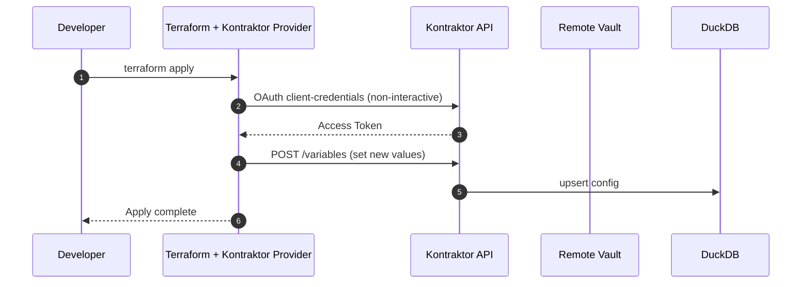

# Kontraktor – Architecture Design Document

> **Version:** 0.2 (June 3 2025)

---

## 1  Purpose & Vision
Kontraktor is a **builder‑helper** that unifies environment configuration, secret aggregation and developer task automation. Inspired by [taskfile.dev](https://taskfile.dev) but extended with a *centralised configuration library* and *remote‑vault integration*, it offers:

1. **Central Configuration Library** – version‑controlled, queryable configuration across many projects and git repositories, stored in DuckDB (non‑secret only).
2. **Secret Aggregation Layer** – read‑only connectors to Azure Key Vault, HashiCorp Vault and AWS Secrets Manager (no secret persisted in Kontraktor).
3. **Task Runner** – local execution of Bash (macOS/Linux) and, later, PowerShell Core routines through an expressive YAML syntax (`taskfile.ktr.yml`).
4. **Terraform Provider** – first‑class plugin that exposes Kontraktor’s API to Terraform so that infrastructure outputs can flow straight into environment configuration variables.

Developers run routines with a single command (e.g. `ktr tf-plan --env=test`) while the CLI transparently fetches configuration, injects secrets, selects the correct workspace and executes the script. Ops teams can reference the same configuration in IaC by declaring `provider "kontraktor" { … }` blocks.

---

## 2  High‑Level Architecture

```mermaid
graph TD
  subgraph Developer Laptop
    CLI[ktr CLI (Go)]
    TaskYAML[taskfile.ktr.yml]
    TF[Terraform + Kontraktor Provider]
  end

  subgraph Kontraktor Cloud/On‑prem
    APIServer[REST + gRPC API Server (Go)]
    DuckDB[(DuckDB Config DB)]
    VaultPlugins[Vault Connector Plugins]
    GitSyncer[Git Repository Syncer]
    WebUI[Web UI (React)]
  end

  CLI -- "HTTPS TLS + OAuth2 (PKCE)" --> APIServer
  TF  -- "HTTPS TLS + OAuth2" --> APIServer
  WebUI -- "HTTPS TLS + OAuth2" --> APIServer
  APIServer --> DuckDB
  APIServer --> GitSyncer
  APIServer -->|fetch/renew secrets| VaultPlugins
  VaultPlugins --> |short‑lived tokens| AzureKV
  VaultPlugins --> HashiCorpVault
  VaultPlugins --> AWSSecrets
```

### 2.1  Component Overview
| # | Component | Main Responsibilities |
|---|-----------|-----------------------|
|①| **ktr CLI** | • Parse YAML • OAuth device‑code flow • Pull config/secret map • Materialise `.env` • Execute tasks • Telemetry |
|②| **API Server** | • REST (OpenAPI 3.1) + gRPC endpoints • OAuth provider federation • RBAC • Git repo management • Vault token brokerage • Metadata caching in DuckDB |
|③| **DuckDB Config DB** | • Stores Projects, Environments, Non‑secret Vars, Task metadata • Fast local analytics |
|④| **Vault Plugins** | • Pluggable Go interfaces for Azure, AWS, HashiCorp • Caching & lease renewal • Return decrypted secret values to API |
|⑤| **Git Syncer** | • Track multiple repos/branches • Webhook or poll • Persist latest taskfile templates & config overrides |
|⑥| **Web UI** | • Dashboard of projects & environments • Config diff viewer • Vault status • Trigger manual syncs |
|⑦| **Terraform Provider** | • Go plugin • Extends terraform‑plugin‑framework • Data sources to read env‑vars / secrets • Resources to *set* non‑secret config from cloud outputs |

---

## 3  API Exposure
* **Protocols:** REST (JSON) and gRPC with mutual TLS option.
* **Spec:** Complete **OpenAPI 3.1** description published at `/openapi.json`; provider and CLI generated via `oapi-codegen`.
* **Versioning:** URI‑based (`/api/v1`), with semver compatibility window.
* **Pagination & Filtering:** RFC 7240‑style `Prefer` headers; cursor pagination.

---

## 4  Terraform Provider Design
### 4.1  Use‑Cases
1. **Import cloud outputs** – After provisioning resources, feed dynamic values (e.g., S3 bucket name, Azure Key Vault URI) into Kontraktor so application environments auto‑update.
2. **Read‑only config** – Query Kontraktor config and secrets inside Terraform plans for conditional logic without scripting.

### 4.2  Provider Block
```hcl
provider "kontraktor" {
  host        = "https://kontraktor.example.com"
  oauth_token = var.kontraktor_token  # supplied via external OIDC workflow
}
```

### 4.3  Data Source Example
```hcl
data "kontraktor_environment" "dev" {
  project = "infra-demo"
  env     = "dev"
}

output "app_url" {
  value = data.kontraktor_environment.dev.variables["APP_URL"]
}
```

### 4.4  Resource Example
```hcl
resource "kontraktor_variable" "db_endpoint" {
  project = "infra-demo"
  env     = "prod"
  key     = "DB_HOST"
  value   = aws_rds_cluster.main.endpoint
  type    = "string"
}
```

### 4.5  Provider Internals
* Built with **terraform‑plugin‑framework** v1.
* Auth uses the same OAuth 2.1 token as CLI (can reuse `~/.config/kontraktor/credentials.json`).
* Batched API requests per apply to minimise latency.

---

## 5  Execution Flow (CLI + Terraform)


---

## 6  Security Enhancements
* **mTLS Option:** Provider and CLI can optionally present client certificates; useful in air‑gapped or SSO‑less environments.
* **Fine‑grained Scopes:** Access tokens carry scopes `env.read`, `env.write`, `secret.read`—provider normally requires only `env.write`.
* **Server‑Side Validation:** DuckDB triggers validate type and schema of values coming from Terraform.

---

## 7  Data Model (DuckDB)
*(unchanged except new audit table for Terraform writes)*
```sql
CREATE TABLE audit_variable_writes (
  id UUID PRIMARY KEY,
  env_id UUID,
  key TEXT,
  old_value TEXT,
  new_value TEXT,
  actor TEXT,
  ts TIMESTAMP
);
```

---

## 8  YAML Taskfile Schema (excerpt, unchanged)
*(see previous version)*

---

## 9  Technology Stack (updates)
| Area | Tech | Reason |
|------|------|--------|
| Terraform | **terraform‑plugin‑framework** | Official SDK, SemVer‑safe |
| API Docs | **OpenAPI 3.1** | Language‑agnostic client generation |

---

## 10  Roadmap (Phased)
| Phase | Scope |
|-------|-------|
| α (M1‑M2) | CLI, API, DuckDB, YAML parsing, local Bash exec |
| β (M3‑M4) | Vault connectors, OAuth GitHub/Azure, Web UI MVP |
| γ (M4‑M5) | **Terraform provider (read‑only)**, OpenAPI published |
| RC (M5) | Git multi‑repo sync, audit logs, Helm/K8s chart |
| GA (M6) | Terraform provider read+write, SaaS multi‑tenant, PowerShell Core, plugin marketplace |

---

## 11  Open Questions
1. Concurrency strategy for DuckDB writes (use WAL + single writer queue?).
2. Policy engine – integrate OPA for fine‑grained environment rules?
3. Secret size limits – do we stream large binary secrets (SSH keys) or restrict to < 64 KB?
4. Should Terraform provider support diff‑suppression for secrets to avoid noisy plans?

---


